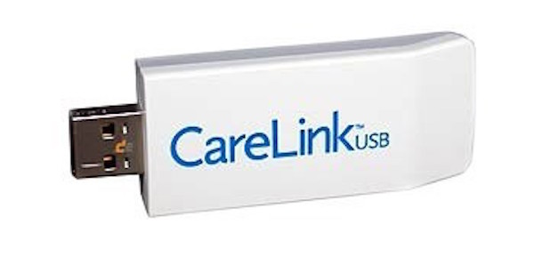
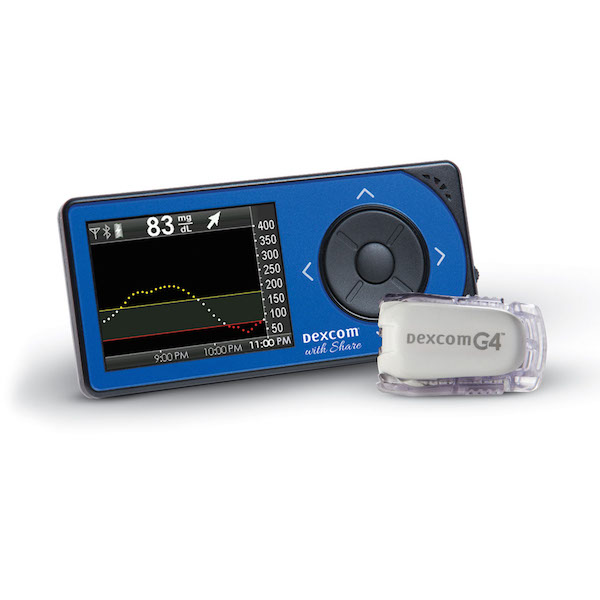
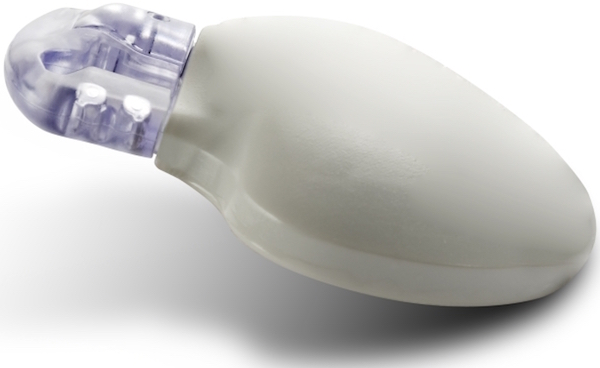
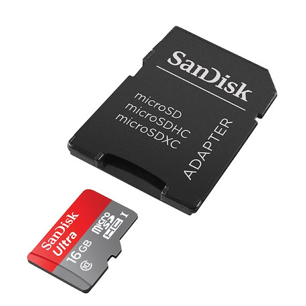
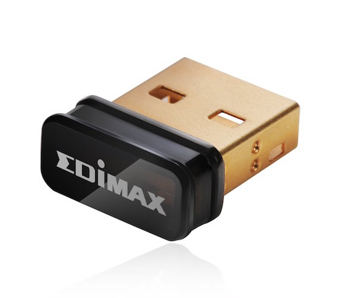
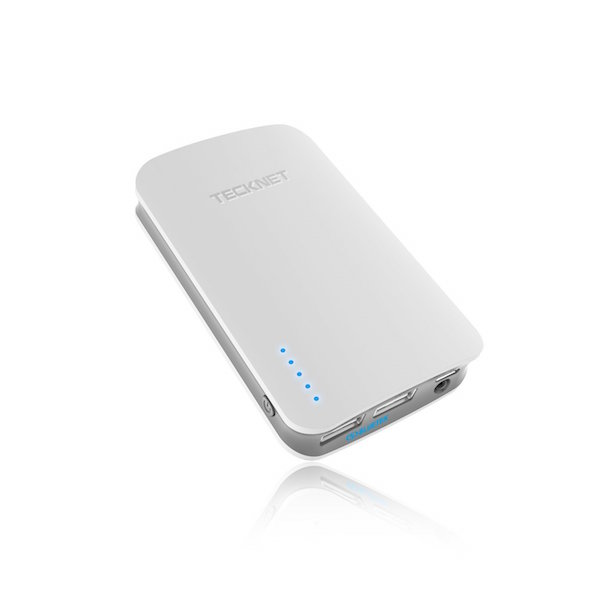

# Hardware
This section describes the hardware components required for a 'typical' OpenAPS implementation. There are numerous variations and substitutions that can be made, but the following items are recommended for getting started. If you come across something that doesn't seem to work, is no longer available, or have a notable alternative, feel free to edit this document with your suggestions.

## Required  Hardware

* Medtronic insulin pump: 512/712, 515/715, 522/722, or 523/723 (with firmware 2.4A or lower)
* Medtronic CareLink USB stick
* Dexcom CGM (G4 Platinum or Platinum with Share system) OR Medtronic CGM (MiniMed Paradigm REAL-Time Revel or Enlite)
* Raspberry Pi 2 Model B
* 8 GB (or greater) micro SD card
* Low-profile USB WiFi adapter
* 2.1 Amp (or greater) USB power supply or battery
* Micro USB cable(s)
* Cat5 or Cat6 ethernet cable [optional]
* HDMI cable [optional]

A mostly complete kit recommended by several #OpenAPS contributors can be purchased through [Amazon](http://www.amazon.com/CanaKit-Raspberry-Complete-Original-Preloaded/dp/B008XVAVAW/ref=sr_1_1?ie=UTF8&qid=1434523139&sr=8-1&keywords=canakit+raspberry+pi+2). This kit has the RPi2, SD card, WiFi adapter, and wall power supply. It also comes with a case, HDMI cable, and heat sink, none of which are required for an OpenAPS build. The kit does not have a micros USB cable (required to connect a Dexcom G4 receiver to the RPi) or a battery, which can be used in lieu of the wall power supply for portability.

Additionally, for the Raspberry Pi and peripherals, verified sets of working hardware can be found [here](http://elinux.org/RPi_VerifiedPeripherals).

Eventually, once you have an entire OpenAPS build up and running, it is recommended that you have backup sets of equipment in case of failure.

## Hardware Details & Recommendations

**Medtronic Insulin Pump: 512/712, 515/715, 522/722, or 523/723 (with firmware 2.4A or lower)**

Due to changes in the firmware, the openaps tools are only able to function in full on the above pump models. Security features were added in firmware version 2.5A that prevent making some remote adjustments via the CareLink USB stick. Each pump series is slightly different, and openaps functionality is still being ironed out for some of them. If you need to acquire an appropriate pump, check CraigsList or put out a request on [Gitter]( https://gitter.im/nightscout/intend-to-bolus) or the [#OpenAPS Google Group](https://groups.google.com/d/forum/openaps-dev). 

There are several #OpenAPS participants working on ways to use other pumps (including non-Medtronic models). If you would like to get more information on the progress in these areas, take a look at the [#OpenAPS Google Group](https://groups.google.com/d/forum/openaps-dev).

 
**CareLink USB Stick**

Currently, the only supported device for uploading pump data and interfacing on the #OpenAPS is the CareLink USB stick. We recommend you purchase at least two sticks because if one breaks, acquiring another stick will take time and will delay development. Additionally, due to the short range of communication between the CareLink stick and the Medtronic pumps, some users set up multiple sticks in different locations to maximize the chances of successful transmissions.

[Medtronic](https://medtronicdiabetes.secure.force.com/store/carelink-usb--remotes/usb-wireless-upload-device)

 [American Diabetes Wholesale](http://www.adwdiabetes.com/product/minimed-carelink-usb-upload_1164.htm)
 

 
 
**CGM: Dexcom G4 Platinum System (with or without Share) OR Medtronic **

The openaps tool set supports two different CGM systems: the Dexcom G4 Platinum system (with or without the Share functionality) and the Medtronic system. With Dexcom, the Share platform is not required as communication with the receiver is accomplished via USB. The Medtronic CGM system communicates directly with its associated pump, so the data can be retrieved using the CareLink USB stick.

[Dexcom G4 Platinum with  Share](http://www.dexcom.com/dexcom-g4-platinum-share)

[Medtronic Enlite](https://www.medtronicdiabetes.com/treatment-and-products/enlite-sensor)

 

**Raspberry Pi 2 Model B**

The Raspberry Pi 2 (RPi2) model B is a credit-card sized single-board computer. The RPi2 primarily uses Linux kernel based operating systems, which must be installed by the user onto a micro SD card for the RPi2 to work. The RPi2 currently only supports Ubuntu, Raspbian, OpenELEC, and RISC OS. We recommend installing either Ubuntu or Raspbian. In this tutorial, you will learn how to do a "cableless" and "headless" install of Raspbian. You will be able to access and control the RPi2 via an SSH client on Windows, Mac OS X, Linux, iOS, or Android.
 
The RPi2 has 4 USB ports, an ethernet port, an HDMI port, and a micro USB power-in jack that accepts 2.1 Amp power supplies. In this tutorial, you will need to access the USB ports, micro USB power-in jack, and possibly the Ethernet jack (if wireless failure occurs). You will not require the HDMI port or a monitor.

[Raspberry Pi 2 Model B](https://www.raspberrypi.org/products/raspberry-pi-2-model-b/)

 
**Micro SD Card**

An 8 or 16 GB micro SDHC card is recommended. Get one that is class-4 or greater and is a recognized name brand, such as SanDisk, Kingston, or Sony. A list of verified working hardware (including SD cards) can be found [here](http://elinux.org/RPi_VerifiedPeripherals).

[SanDisk Ultra 16GB Ultra Micro SDHC UHS-I/Class 10 Card with Adapter](http://www.amazon.com/gp/product/B010Q57SEE)

[Sony 16GB Class 10 UHS-1 Micro SDHC](http://www.amazon.com/Sony-Class-Memory-SR16UY2A-TQ/dp/B00X1404P8)

 
**WiFi Adapter**

A minimalistic, unobtrusive WiFi USB adapter is recommended. The low-profile helps to avoid damage to both the RPi2 and the adapter as the RPi2 will be transported everywhere with the patient.

[Edimax EW-7811Un 150Mbps 11n Wi-Fi USB Adapter](http://www.amazon.com/Edimax-EW-7811Un-150Mbps-Raspberry-Supports/dp/B003MTTJOY/ref=sr_1_1?ie=UTF8&qid=1432614150&sr=8-1&keywords=edimax)

[Buffalo AirStation N150 Wireless USB Adapter](http://www.amazon.com/BUFFALO-AirStation-N150-Wireless-Adapter/dp/B003ZM17RA/ref=sr_1_1?ie=UTF8&qid=1434523524&sr=8-1&keywords=airstation+n150)

 
**2.1 Amp USB Battery Power Supply**

A large-capacity power supply that is greater than 8000 mAh (milliAmp-hours) is recommended for full day use. Make sure that the battery has at least one 2.1 Amp USB output. A battery with a form-factor that minimizes size is recommended, to allow the patient to be as ambulatory as possible. When you have a full #OpenAPS system implemented and working, you will want to have multiple batteries to rotate and recharge. A battery that can deliver power while it charges is ideal as you will be able to charge it on-the-fly without shutting down and restarting the RPi2.

[TeckNet® POWER BANK 9000mAh USB External Battery Backup Pack](http://www.amazon.com/gp/product/B00FBD3O2M)

[Power Bank 12000mAh Vinsic Genius External Mobile Battery Charger Pack](http://www.amazon.com/dp/B00M6V0R2C)

 
**USB Cables**

USB cables with a micro connector on one end and a standard (Type A) connector on the other are used to connect the power supply and the Dexcom receiver to the RPi2. Most cables will work fine, so but some prefer to select lengths and/or features (such as right-angled connectors) to improve portability.

[Rerii Black Golden Plated 15 cm Length Micro-B Male Left Angle USB cable](http://www.amazon.com/Rerii-Micro-B-Charging-Guarantee-Fulfilled/dp/B00S9WXY5O/ref=sr_1_8?ie=UTF8&qid=1434603920&sr=8-8&keywords=micro+usb+right+angle)

[Monoprice Premium USB to Micro USB Charge, Sync Cable - 3ft](http://www.monoprice.com/Product?c_id=103&cp_id=10303&cs_id=1030307&p_id=9763&seq=1&format=2)