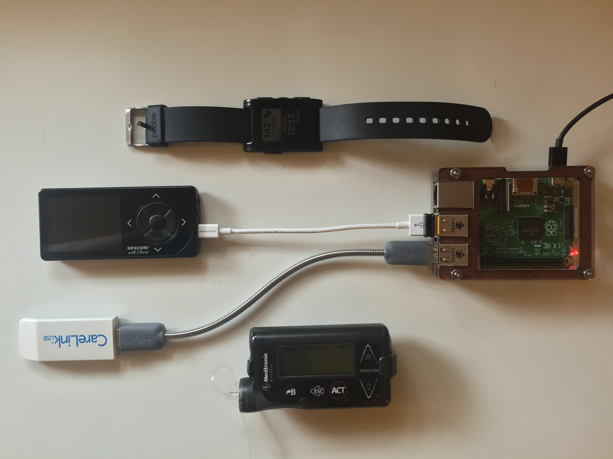

# Introduction 

Welcome to the [openaps](https://github.com/openaps/) documentation!

openaps is part of a set of [development tools](https://net.educause.edu/ir/library/pdf/ELI7088.pdf) to support a self-driven Do-It-Yourself (DIY) implementation of an artificial pancreas based on the [OpenAPS reference design](http://openaps.org/open-artificial-pancreas-system-openaps-reference-design/).

By proceeding to use these tools or any piece within, you agree to the copyright (see LICENSE.txt for more information) and release any contributors from liability. 

The tools may be categorized as:

*  **monitor** collecting data and operational status from devices, and/or aggregating as much data as is relevant into one place

* **predict** make predictions about what will happen next

* **control** enacting changes, and feeding more data back into the **monitor**, closing the loop

You may also find this flowchart helpful to further break down the areas of monitor, predict, and control into various stages of general setup; logging, cleaning, and analyzing data; building a manual system; automating your work; and iterating and improving.

## A Note on DIY and the "Open" Part of OpenAPS

This is a set of development tools to support a self-driven DIY implementation. Any person choosing to use these tools is solely responsible for testing and implementing these tools independently or together as a system.  

The [DIY part of OpenAPS is important](http://bit.ly/1NBbZtO). There are very good reasons why this isn't a single downloadable script. While formal training or experience as an engineer or a developer is not a prerequisite, a growth mindset is required to learn to work with the "building blocks" that will help you develop your OpenAPS instance. Remember as you consider this project that this is not a "set and forget" system; and OpenAPS implementation requires diligent and consistent testing and monitoring to ensure each piece of the system is monitoring, predicting, and controlling as desired.  The performance and quality of your system lies solely with you.

This community of contributors believes in "paying it forward," and individuals who are implementing these tools are asked to contribute by asking questions, helping improve documentation, and contributing in other ways.

## OpenAPS System Development Phases

This documenation is organized into a series of phases that progressively build upon the openaps development tools towards a working OpenAPS system. The phases are as follows: 

* [Phase 0: General Setup](docs/Overview/initial-setup.md) 
Record baseline data, acquire and configure hardware, install software, and become familiar with the openaps environment

* [Phase 1: Logging, Cleaning, and Analyzing Your Data](docs/Overview/data-collection.md) 
Create tools for logging and analyzing pump and CGM data

* [Phase 2: Build a Manual System](docs/Overview/manual-system.md) 
Use the logged data with oref0 tools to suggest insulin dose adjustments, review and refine algorithms, test different scenarios for safety, prepare for creating a loop and implementing retry logic

* [Phase 3: Automate Your System](docs/Overview/automate-system.md) 
Apply the recommendations automatically and in real time by creating a schedule and continuing to validate and assess outputs

* [Phase 4: Iterate and Improve](docs/Overview/iterate-improve.md) 
Improve the functionality of the system with additional software or hardware development

At the beginning of each phase, an outline summarizes:

* Upon Completion—The capabilities that the user and system should have after completing the phase
	
* Phase Tasks—Tasks or steps to take during the phase

* Community Contribution—How users should be able to contribute to the #OpenAPS project and/or openaps development tool set during and after the phase
